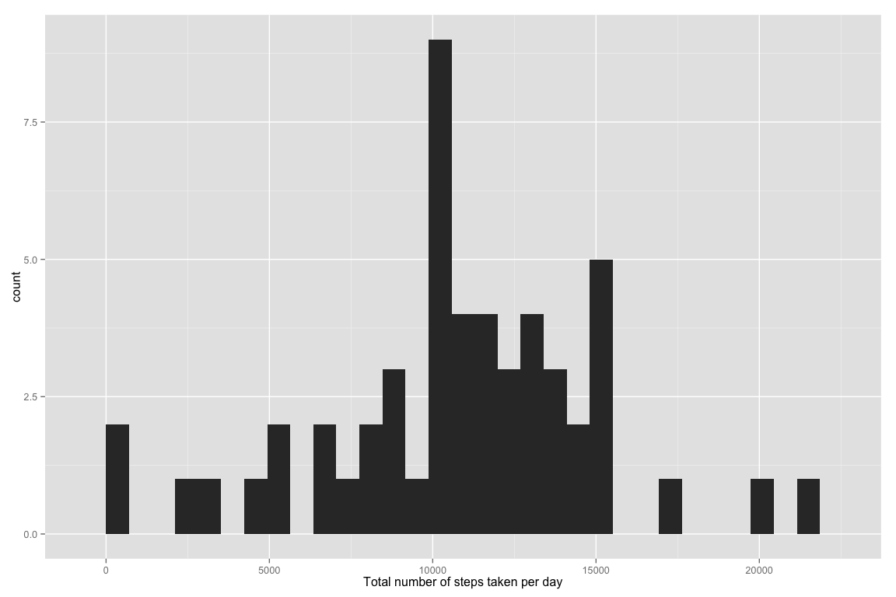
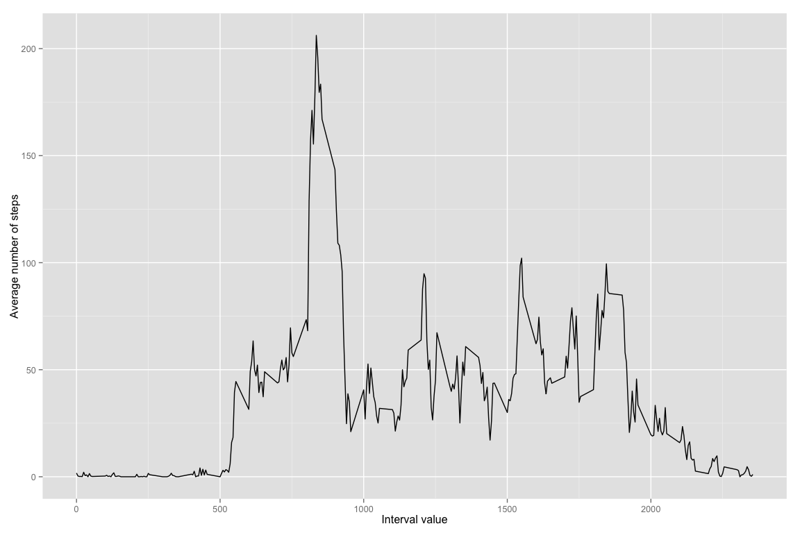
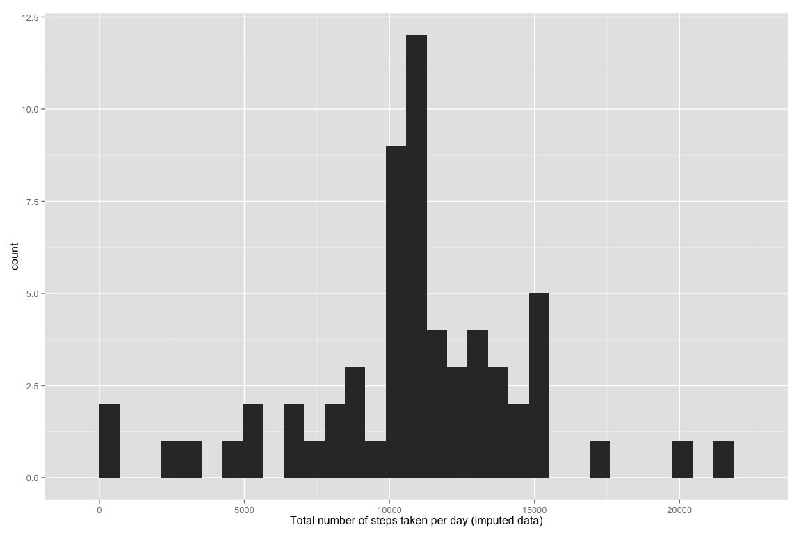
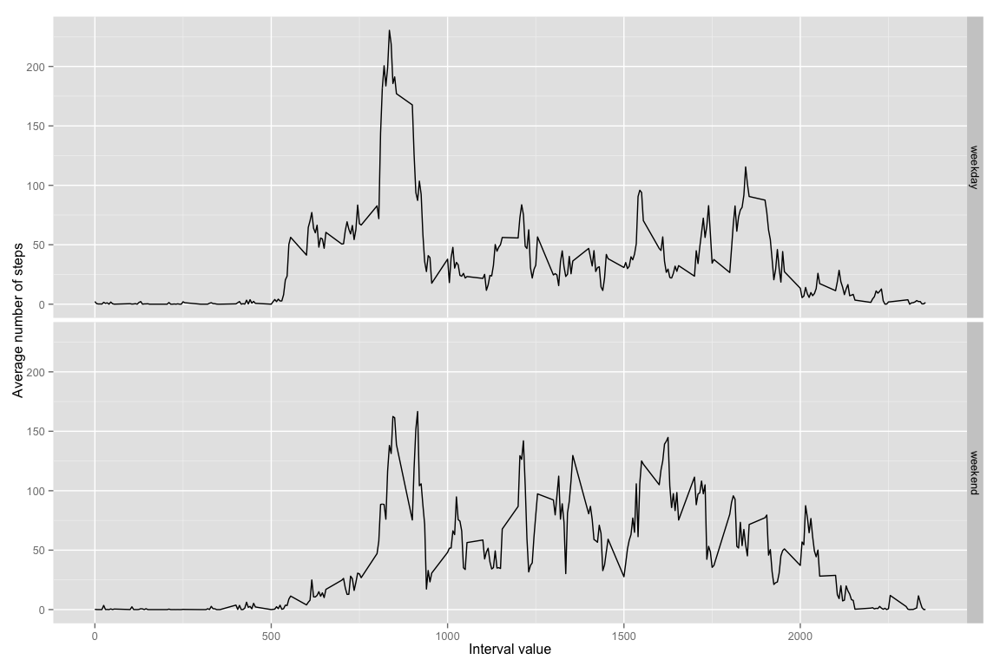

# Reproducible Research: Peer Assessment 1
funkje  

## Loading libraries

* Data.table is my weapon of choice for manipulating data frames because of its speed and functionality.
* Ggplot2 lets me quickly prodcue nice graphs.


```r
library(data.table)
library(ggplot2)
```

## Loading and preprocessing the data

Loading the data and converting 'date' string into the proper date format. Also converting 'steps' to numeric format because it store
non-integer types in the future.

```r
activityData <- fread("activity.csv")
activityData[, `:=` (date = as.Date(date), steps = as.numeric(steps))]
```

## What is mean total number of steps taken per day?

Calculating the total number of steps for each day:

```r
dailyTotal <- activityData[, .(stepsSum = sum(steps)), keyby = "date"]
```

Plotting the histogram of total number of steps taken each day:

```r
ggp <- ggplot(data = dailyTotal, aes(x = stepsSum)) +
    geom_histogram(stat = "bin") +
    labs(x = "Total number of steps taken per day")
print(ggp)
```

 

Now lets calculate the mean total number of steps taken per day:

```r
stepsMean <- mean(dailyTotal$stepsSum, na.rm = TRUE)
```

and now the median total number of steps taken per day:

```r
stepsMedian <- median(dailyTotal$stepsSum, na.rm = TRUE)
```

The mean total number of steps taken per day is 10766.19 and the median total number of steps taken per day is 10765.

## What is the average daily activity pattern?

Lets prepare the data:

```r
dailyAverage <- activityData[, .(stepsAverage = mean(steps, na.rm = TRUE)),
                             keyby = .(interval)]
```

And now lets use them to produce the timeseries plot:

```r
ggp <- ggplot(data = dailyAverage, aes(x = interval, y = stepsAverage)) +
    geom_line() +
    labs(y = "Average number of steps", x = "Interval value")
print(ggp)
```

 

To figure out which interval contains on average the highest number of steps, lets run:

```r
maxInterval <- dailyAverage[stepsAverage == max(dailyAverage$stepsAverage), interval]
```

The 5 minute interval containing the highest average number of total steps is 835.

## Imputing missing values

The total number of missing values:

```r
sum(is.na(activityData$steps))
```

```
## [1] 2304
```

Lets replace the missing data with the average values for the given interval across the dataset:

```r
activityDataI <- merge(activityData, dailyAverage, by = "interval") # merge average values with the original dataset
activityDataI[is.na(steps), steps := stepsAverage] # replace NAs with the average values
```

Plotting the histogram of total number of steps taken each day using the imputed data:

```r
dailyTotalI <- activityDataI[, .(stepsSum = sum(steps)), keyby = "date"]
ggp <- ggplot(data = dailyTotalI, aes(x = stepsSum)) +
    geom_histogram(stat = "bin") +
    labs(x = "Total number of steps taken per day (imputed data)")
print(ggp)
```

 

Now lets calculate the mean total number of steps taken per day for the imputed data:

```r
stepsMeanI <- mean(dailyTotalI$stepsSum, na.rm = TRUE)
```

and now the median total number of steps taken per day for the imputed data:

```r
stepsMedianI <- median(dailyTotalI$stepsSum, na.rm = TRUE)
```

The mean total number of steps taken per day is 10766.19 for the original data and 10766.19 for the imputed data.
The median total number of steps taken per day is 10765 for the original data and 10766.19 for the imputed data.
As expected, the mean total number of steps hasnt changed. The median total number of steps has increased only slightly.

## Are there differences in activity patterns between weekdays and weekends?

Lets create a new factor variable indicating weekdays and weekends in the imputed dataset:

```r
activityDataI[, weekend := as.factor(weekdays(date) %in% c("Saturday", "Sunday"))]
levels(activityDataI$weekend) <- c("weekday", "weekend")
```

Now lets prepare the avereges data for the plot:

```r
dailyAverageI <- activityDataI[, .(stepsAverage = mean(steps, na.rm = TRUE)),
                               keyby = .(interval, weekend)]
```

And finally lets produce the panel plot:

```r
ggp <- ggplot(data = dailyAverageI, aes(x = interval, y = stepsAverage)) +
    geom_line() +
    facet_grid(weekend ~ .) +
    labs(y = "Average number of steps", x = "Interval value")
print(ggp)
```

 
